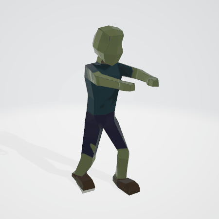

# Zombie VR Game

## Proyecto Final de la Asignatura Interfaces Inteligentes 
## Universidad de La Laguna
## Desarrollado por:
  * José Nicolás Cabrera Domínguez
  * Chirstian Jesús Pérez Hernández
  * Basilio Gómez Navarro
  * Daniel Oria Martín

## Informe del proyecto

## Indice
  * Introducción
  * Diseño del Escenario, modelos y animaciones
  * Hitos de programación logrados
  * Aspectos a destacar
  * Ejecución del programa
  * Acta de acuerdos

## Introducción
Aunque finalmente nos decantamos por esta idea de un juego de Zombies, nuestra idea inicial era hacer una juego de cocina multijugador local en la que los distintos jugadores se tuviesen que coordinar para preparar distintos platos dentro de un mismo escenario de cocina. Nos encontramos con el problema de que este juego se veía desde arriba como si fuese un plano en 2D y no le veíamos aplicacion posible a la hora de aplicar VR. Es por esto que nos decantamos por hacer este juego de Zombies, después de un gran esfuerzo y mucho trabajo estamos contentos con los resultados alcanzados.

El juego está inspirado por el modo Zombies de la famosa saga de juegos Call of Duty, el jugador aparece en un escenario con un arma, van spawneando zombies por rondas y el jugador tiene que acabar con ellos para conseguir puntos, mejorar sus armas y abrir nuevas zonas del mapa. A lo largo del mapa hay 4 máquinas de ventajas distintas en las cuales el jugador puede dejar parte de los puntos acumulados para conseguir pequeñas ventajas que le ayudarán a pasar más rondas.

## Diseño del Escenario, modelos y animaciones
Desde el principio teníamos claro que queríamos limitar el uso de Assets de la Unity Store y crear nuestros propios modelos. Primeramente empezamos directamente en Unity pero al poco tiempo vimos que era totalmente inviable diseñar modelos complejos en el programa, por lo que decidimos usar Blender.

Tenemos dos escenas principales, una con el menú en el cual se pueden elegir distintas opciones antes de jugar o salir del juego y otra escena con el juego en sí.

El escenario fue diseñado completamente en Blender, lo hicimos separando por habitaciones y pasillos. Nuestra meta era que quedase un escenario visualmente agradable, no muy complejo y "circular", es decir, que no hubiese puntos muertos en los cuales quedarse atascado o habitaciones que no diesen a ningún lado para dar así una sensación de continuidad mientras se juega. 

Después le aplicamos texturas a cada habitación y luces dentro de Unity para que el juego cobrase algo mas de vida.

El modelo de los Zombies y sus animaciones tambien las hicimos por completo en Blender. Queríamos que fuese algo más que un modelo simplista para dar algo más de immersión. Para ello lo modelamos partiendo de una forma básica (un cubo) para después crear un esqueleto que facilitara la animación. Creamos dos animaciones con el modelo, una para el movimiento y otra de ataque.

Las 4 máquinas de ventajas que se encuentran por el mapa también las diseñamos en Blender. 

## Hitos de programación logrados

Por otra parte, la lógica del juego, ha sido desarrollada, poniendo en práctica gran parte de los conocimientos adquiridos en la asignatura. En concreto, se puede destacar la utilización de delegados, eventos, raycasts, realidad virtual, sensores entre otros.  Así mismo, también hemos utilizado elementos básicos de unity, como son los controles del movimiento del jugador, físicas en los objetos, colliders, assets, etc.

En cuanto a delegados y eventos se puede destacar el uso de estos en el script *MoveTowards.cs* en el cual se emplean para gestionar el daño que se le aplica al jugador cuando un zombie le ataca.

Por parte de los raycasts, estos han sido utilizados para elaborar los disparos de las armas a los zombies.

La realidad virtual ha sido empleada para el desarrollo de la apk que puede ser ejecutada y visualizada en un dispositivo android con algún tipo de accesorio del tipo “Google Cardboard”. Para ello se ha empleado el paquete VR de Google para unity y dispositivos android, tal y como se trabajó en clase.

Los sensores se han empleado para 4 tareas fundamentalmente. En primer lugar, se ha utilizado el acelerómetro del dispositivo móvil para rotar la cabeza de un pequeño personaje 3D que se sitúa en la parte inferior izquierda de la pantalla y se mueve siguiendo el movimiento de la cabeza del jugador, en segundo lugar, se ha empleado el sensor del GPS para localizar al jugador en el menú de inicio del juego, en tercer lugar, hemos introducido un asset de un televisor en una de las habitaciones del mapa que muestra lo que se ve por la webcam del jugador y en cuarto y último lugar, hemos implementado un sistema de reconocimiento de voz que permite abrir el GameObject “BigDoor”, de tal manera que cuando el jugador se encuentre a una distancia determinada de la puerta y pronuncie la palabra “ábrete”, se abrirá la puerta y podrá acceder a una sala sorpresa del escenario del juego.

Además de lo anterior, se ha implementado el manejo del juego para un mando del estilo Xbox siguiendo los controles que se muestran a continuación:

## Aspectos a destacar
Hay distintas cosas que consideramos a destacar dentro del proyecto.

Dos de ellas ya las hemos comentado previamente y son, el uso del mando para jugar y la implemetanción de nuestros propios modelos hecho en Blender.
Un tercer aspecto a destacar son los efectos de sonido y la música usada para la immersión. Hemos usado varios efectos de sonido distintos, cada arma tiene su propio sonido de disparo, hay sonidos al comprar en las máquinas y al abrir zonas nuevas del mapa y cuando golpean al jugador. En el menú principal cada botón tiene sonido para cuando se pasa por encima con el ratón o con el mando y otro para cuando es seleccionado.
Además el menú y el juego constan de dos bandas sonoras que dan immersión al juego y lo hacen más disfrutable. 

## Acta de acuerdos

Para distribuirnos las tareas creamos una lista en la aplicación *Zenkit*. Creamos distintas entradas con los aspectos a desarrollar y los problemas a resolver, y cada uno se iba asignando distintas tareas. Para juntar las distintas partes del juego que iba desarrollando cada uno creamos un repositorio de *GitHub* al que ibamos subiendo los cambios.

## Ejecución del programa

Se puede visualizar una pequeña demostración de la ejecución del juego en un PC en [este vídeo]()

**Por otra parte [en este enlace]() se puede visualizar la ejecución del juego en un dispositivo móvil Android. ???????????????????????????**

